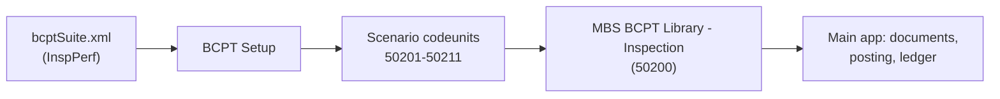

# MBS Site Inspection Scheduling - Performance Test

Business Central Performance Toolkit (BCPT) scenarios for the [MBS Site Inspection Scheduling](../README.md) extension.

## Problem

Inspection creation, posting, and history queries run against shared tables (number series, ledger entries, registers). Whether they hold up under volume and concurrent sessions is unknown without measurement, for example several coordinators scheduling for the same inspectors or sites, or many posts competing for ledger entry numbers.

## Why this matters

It gives a repeatable baseline for the inspection workflow's data volume and concurrency behavior, and shows how to structure BCPT scenarios (library, scenario codeunits, suite file) on AL-Go.

## Architecture

- **Scope:** 11 scenario codeunits (50201-50211) plus one shared library (50200), all using the `BCPT Test Context` codeunit from Microsoft's Performance Toolkit. Each scenario wraps its measured operation in `StartScenario` / `EndScenario`.
- **Self-contained data:** the library creates its own inspection setup, `BCPT-*` number series, inspection types, and pools of inspectors and customer sites, so scenarios do not depend on the dataset app.
- **Suite:** `bcptSuite.xml` (suite code `InspPerf`, 5-minute duration) defines the BCPT suite lines.
- **Access:** write-heavy, inside Business Central only. Intended for a sandbox.

### Scenarios

**Creation**

| Codeunit | ID | Description | Parameters (default) |
|----------|----|-------------|----------------------|
| MBS BCPT Create Insp. Type | 50201 | Single type creation | - |
| MBS BCPT Create Insp. Type Blk | 50202 | Bulk type creation | `InspectionTypes=100` |
| MBS BCPT Create Inspection | 50203 | Single inspection with lines | `Lines=10` |
| MBS BCPT Create Inspection Blk | 50204 | Bulk inspection creation | `Inspections=100,Lines=10` |

**Posting**

| Codeunit | ID | Description | Parameters (default) |
|----------|----|-------------|----------------------|
| MBS BCPT Post Inspection | 50205 | Post single inspection | `Lines=10` |
| MBS BCPT Post Inspection Blk | 50206 | Post batch of inspections | `Inspections=50,Lines=10` |
| MBS BCPT Post Insp. Validation | 50207 | Validation failure path; fails if a rejected post leaves partial posted records | - |

**Query**

| Codeunit | ID | Description | Parameters (default) |
|----------|----|-------------|----------------------|
| MBS BCPT Overdue Backlog Query | 50208 | Query overdue inspections | `Inspections=500` |
| MBS BCPT Repeat Site Query | 50209 | Query repeated-site history | `HistoryPerSite=50` |

**Contention**

| Codeunit | ID | Description | Parameters (default) |
|----------|----|-------------|----------------------|
| MBS BCPT Inspector Contention | 50210 | Shared inspector assignment | `SharedInspectors=3,Inspections=20` |
| MBS BCPT Site Contention | 50211 | Shared site scheduling | `Sites=2,Inspections=30` |

**Library**

| Codeunit | ID | Purpose |
|----------|----|---------|
| MBS BCPT Library - Inspection | 50200 | Setup, data creation, posting, seeding helpers |

## Demo steps

1. Publish the main *MBS Site Inspection Scheduling* app, then this performance test app, in a sandbox.
2. Open **BCPT Setup** in Business Central.
3. Import `bcptSuite.xml` or configure scenarios manually.
4. Run the suite.
5. Review the results in BCPT.

## What is intentionally simple

- Parameter defaults are set in code; the suite file does not override them.
- Fixed delays and session counts in the suite file (1 to 3 sessions per scenario).
- Scenarios build their own small data pools instead of loading a production-like dataset.

## Risks/limits

- **The suite file configures 9 of the 11 scenarios.** The two query scenarios (50208, 50209) are not in `bcptSuite.xml` and must be added manually.
- Results are only as realistic as the seeded data.
- **No baseline thresholds are configured** (no thresholds file is tracked), so runs are measured but not compared against pass/fail targets.
- Writes data (`BCPT-*` number series, inspections, ledger entries). Use sandbox environments only.

## Next iteration

- Add the query scenarios to the suite and set explicit parameters.
- Define baseline thresholds and compare runs in CI.
- Add scenarios with realistic data volumes (large ledger, many sites) and mixed workloads.

## Notes

- **Object ID range:** `50200..50299`
- **Dependencies:** MBS Site Inspection Scheduling (main app); Microsoft Performance Toolkit; Microsoft Tests-TestLibraries.
- **Structure:** `src/Create`, `src/Post`, `src/Query`, `src/Contention` hold the scenarios; `src/Library` holds the shared helpers.
- **CI:** registered under `bcptTestFolders` in `.AL-Go/settings.json`; the AL-Go build publishes the BCPT results as a build artifact.
- **License:** [MIT](../LICENSE)
