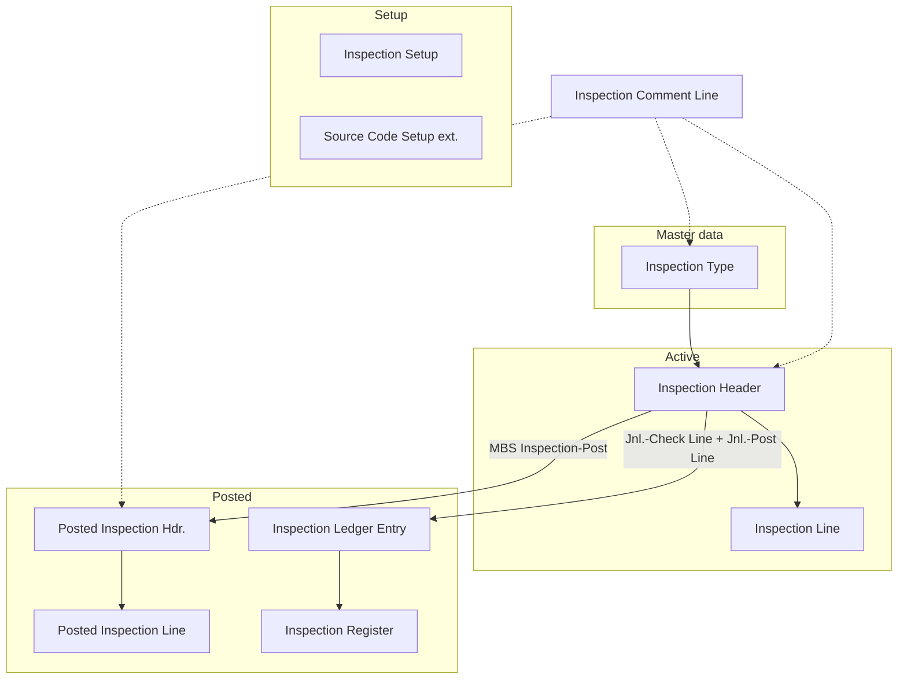

# MBS Site Inspection Scheduling

The main Business Central extension for managing site inspections, from scheduling through posting to historical analysis. Part of the [MBS Site Inspection Scheduling](../README.md) repository.

## Problem

Recurring inspections (safety, compliance, equipment, readiness) are usually tracked outside the ERP, so scheduled work, findings, and history are scattered. This app provides a Business Central-native workflow: reusable inspection types, scheduled inspection documents against customer sites, and immutable posted history with a ledger. See the [root README](../README.md) for personas and context.

## Why this matters

It follows the standard BC document, posted document, ledger, and register pattern, so the structure is familiar to BC developers and consultants. Customers act as sites and resources of type Person act as inspectors, so no parallel master data is needed.

## Architecture

**Posting behaviour** (`MBS Inspection-Post`):

1. Requires posting date, document date, inspection type, customer, inspector, and status *Closed*, plus at least one line.
2. Assigns a posting number from the *Posted Inspection Nos.* series.
3. Creates the posted header and lines and copies comment lines to the posted record.
4. Posts one inspection journal line (an internal buffer) through check and post codeunits to create the ledger entry and update the register.
5. Deletes the source document, its lines, and its comments.

**Other rules:** a blocked inspection type cannot be assigned; document duration defaults from the inspection type; an *Unsatisfactory* line result requires a description.

**Install:** `MBS Inspection Install` creates the source code `MBSINSP` (*Site Inspection Posting*) and stores it in the extended `Source Code Setup`.

**Access and security:** all tables and codeunits are `Access = Internal` and exposed only to the companion apps via `internalsVisibleTo`. Permissions come from one set, `MBS Insp. All Users`. There are no APIs, events, or external components.

### Tables

| ID | Name | Purpose |
|----|------|---------|
| 50000 | MBS Inspection Setup | Number series and default configuration |
| 50001 | MBS Inspection Type | Master data for inspection categories |
| 50002 | MBS Inspection Header | Active inspection documents |
| 50003 | MBS Inspection Line | Checklist items and findings |
| 50004 | MBS Inspection Comment Line | Comments across all document types |
| 50005 | MBS Posted Inspection Hdr. | Posted inspection header |
| 50006 | MBS Posted Inspection Line | Posted inspection lines |
| 50007 | MBS Inspection Ledger Entry | Audit trail entries |
| 50008 | MBS Inspection Register | Posting register |
| 50009 | MBS Inspection Journal Line | Internal posting buffer |

Table extension: 50000 `MBS Source Code Setup` extends `Source Code Setup` with the *Site Inspection* source code.

### Pages

| ID | Name | Type |
|----|------|------|
| 50010 | MBS Inspection Setup | Card |
| 50011 | MBS Inspection Type List | List |
| 50012 | MBS Inspection Type Card | Card |
| 50013 | MBS Inspection Comment Sheet | List |
| 50014 | MBS Inspection Comment List | ListPart |
| 50015 | MBS Inspection | Document |
| 50016 | MBS Inspection List | List |
| 50017 | MBS Inspection Subpage | ListPart |
| 50018 | MBS Posted Inspection | Document |
| 50019 | MBS Posted Inspection List | List |
| 50020 | MBS Posted Inspection Subpage | ListPart |
| 50021 | MBS Inspection Ledger Entries | List |
| 50022 | MBS Inspection Registers | List |

### Codeunits

| ID | Name | Purpose |
|----|------|---------|
| 50030 | MBS Inspection-Post | Core posting logic |
| 50031 | MBS Inspection-Post (Yes/No) | Posting with confirmation dialog |
| 50032 | MBS Inspection Jnl.-Check Line | Journal line validation |
| 50033 | MBS Inspection Jnl.-Post Line | Journal line posting to ledger |
| 50034 | MBS Inspection Install | Install: creates the source code and registers it in Source Code Setup |

### Enums

| ID | Name | Values |
|----|------|--------|
| 50040 | MBS Inspection Status | Planning, Open, Closed |
| 50041 | MBS Inspection Result Status | (blank), Satisfactory, Unsatisfactory, Not Inspected |
| 50042 | MBS Inspection Entry Type | Inspection |
| 50043 | MBS Insp. Comment Table Name | Inspection Type, Inspection, Posted Inspection |
| 50044 | MBS Inspection Priority | Low, Medium, High, Critical |

### Permission set

| ID | Name | Purpose |
|----|------|---------|
| 50050 | MBS Insp. All Users | Execute on all tables, pages, and posting codeunits; RIMD on all table data |

## Demo steps

1. **Setup:** open *Inspection Setup* and configure number series for types, inspections, and posted inspections.
2. **Create types:** open *Inspection Types* and create categories (e.g. Safety Walkthrough, Compliance Audit).
3. **Schedule:** open *Inspections*, create a document, and assign type, customer site, and inspector.
4. **Inspect:** add checklist lines with findings (Satisfactory / Unsatisfactory).
5. **Post:** set status to *Closed* and press **Post** (F9).
6. **Verify:** check *Posted Inspections*, *Inspection Ledger Entries*, and *Inspection Registers*.

## What is intentionally simple

- One ledger entry type (*Inspection*) and one journal line per posted inspection.
- Status is a plain enum (*Planning*, *Open*, *Closed*), with no transition rules beyond "must be *Closed* to post".
- No reports, APIs, events, role center, or telemetry.

## Risks/limits

- **Posted records are protected by page-level read-only and internal access only.** The tables have no modify or delete guards, and the permission set grants RIMD on them.
- **One permission set** covers every role.
- **`Default Duration` and `Overdue Threshold Days`** in setup are not read by any logic.
- **Posting is destructive for the source document.** The active document is deleted once the posted record exists.
- Demo/sample app: not production-hardened or packaged for AppSource.

## Next iteration

- Table-level immutability guards and role-based permission sets.
- Wire up or remove the unused setup fields; enforce status transitions.
- Publish events around posting for partner extensibility.

## Notes

- **Object ID range:** `50000..50099`
- **Dependencies:** Business Central platform and application 28.0.0.0 or later; no external app dependencies.
- **License:** [MIT](../LICENSE)
