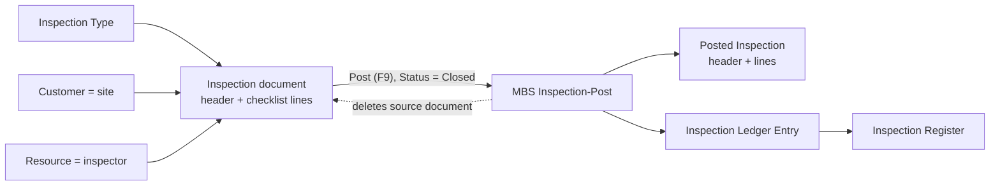

# MBS Site Inspection Scheduling

A Microsoft Dynamics 365 Business Central **Per-Tenant Extension (PTE)** demo for scheduling, executing, posting, and reviewing site inspections. Built on the [AL-Go for GitHub](https://aka.ms/AL-Go) PTE template as four AL projects: the main app, a test app, a dataset app, and a performance test app.

## Problem

Organizations run repeated inspections for quality, compliance, safety, or readiness reasons, but the process is often fragmented across spreadsheets, PDFs, email, and field notes. It becomes hard to answer: *what was inspected, by whom, with what result, and which sites keep coming up?*

This is a functional-process and AL development scenario: a Business Central-native inspection workflow, with no external services involved.

Who it serves:

- **Inspection Coordinator** - schedules inspections and manages backlog and overdue work
- **Inspector** - performs inspections and records findings
- **Compliance / Quality Manager** - reviews historical outcomes and recurring issues
- **Operations Manager** - tracks site readiness and completion trends

## Why this matters

- **Business value:** one system of record for planned work, findings, and immutable history, queryable by site, inspection type, and inspector.
- **Native BC pattern:** the design follows the standard document, posted document, ledger entry, and register pattern, with customers as sites, resources as inspectors, and number series and source codes for numbering and audit.
- **Partner reuse:** the repository doubles as a reference for AL-Go project layout, with namespaces and separate test, dataset, and performance test apps.

## Architecture

**Business Central scope.** A setup table, inspection type master data, an inspection document (header and checklist lines), a posted-document pair, an inspection ledger with registers, and comment lines shared across all three document levels. Standard BC objects used: `Customer` (the site), `Resource` of type Person (the inspector), `No. Series`, and `Source Code Setup` (extended with a *Site Inspection* source code, `MBSINSP`, created by the install codeunit).

**Flow.** Posting (F9 on the inspection document) validates the header and lines, assigns a posting number, creates the posted header and lines, copies comments, writes one ledger entry and updates the register, then **deletes the source document**.

**Boundaries.**

- Everything stays inside Business Central. There are no APIs, events, external components, or AI, Copilot, agent, MCP, Power Platform, or Azure integration.
- Access pattern: read and write inside BC. No approval flow and no write-back to external systems.
- Security: one assignable permission set (`MBS Insp. All Users`, 50050). Tables and posting codeunits are `Access = Internal`; the three companion apps are granted access through `internalsVisibleTo`.
- Target: `Cloud` (SaaS), platform and application `28.0.0.0`, runtime `17.0`.

| Capability | Description |
|---|---|
| **Inspection Types** | Reusable inspection categories (Safety, Compliance, Equipment, etc.) |
| **Inspection Documents** | Schedule inspections against customer sites, with inspectors and checklist lines |
| **Posting** | Post completed inspections to create historical records |
| **Ledger & Register** | Audit trail via inspection ledger entries and posting registers |
| **Comments** | Comments on inspection types, active documents, and posted history |

See [`App/README.md`](App/README.md) for the full object reference.

## Demo steps

**Prerequisites:** a Business Central 28.0+ sandbox with the **App** project published.

1. Open **Inspection Setup** and configure the number series (types, inspections, posted inspections).
2. Open **Inspection Types** and create categories (e.g. Safety Walkthrough, Compliance Audit).
3. Open **Inspections**, create a document, and assign a type, site (customer), and inspector.
4. Add checklist lines with findings (Satisfactory / Unsatisfactory).
5. Set the status to **Closed** and **Post** (F9).
6. Verify under **Posted Inspections**, **Inspection Ledger Entries**, and **Inspection Registers**.

**Optional demo data:** publish **App.Dataset** (requires Microsoft's Contoso Coffee Demo Dataset), open **Contoso Demo Tool**, select the *Site Inspection Scheduling* module, and run generation. It seeds master data, scheduled, overdue, and ready-to-post inspections, and posted history across sites. See [`App.Dataset/README.md`](App.Dataset/README.md).

## What is intentionally simple

- Single permission set and a single ledger entry type (*Inspection*).
- Overdue work is a filter (open status, planned date in the past), not a computed state.
- No reports, APIs, role center, or extension events.
- No telemetry.
- Demo-scale data: a handful of types, inspectors, and customer sites.
- Demo-grade tests and BCPT scenarios, not an exhaustive suite.

## Risks/limits

- **Not production-ready.** A demo/sample intended to showcase AL-Go and modern AL practices (namespaces, layered test/performance/dataset apps). Not an officially supported Microsoft product.
- **Immutability is enforced at page level only.** Posted and ledger pages are read-only and the objects are internal, but the tables have no modify or delete guards and the permission set grants RIMD on them. The test suite documents this explicitly.
- **No role separation.** All personas share one permission set.
- **Unused setup fields.** `Default Duration` and `Overdue Threshold Days` are stored and editable, but no logic reads them yet. Duration on a document defaults from the inspection type, not from setup.
- **Status transitions are not enforced.** The only rule is that posting requires *Closed*.
- **Posting deletes the source document**, its lines, and its comments after copying them to the posted record.
- **Test depth varies.** See [`App.Test/README.md`](App.Test/README.md).
- **Sandbox assumption.** Not packaged or validated for AppSource.

## Next iteration

1. Enforce immutability on posted and ledger tables, and split the permission set into role-based sets (coordinator, inspector, read-only reviewer).
2. Make *overdue* a real concept: use `Overdue Threshold Days` in a list filter, FlowField, or role center cue, and either use or drop `Default Duration`.
3. Enforce status transitions on the inspection header.
4. Add integration or business events around posting so partners can extend it.
5. Tighten tests so assertions match their names, and run permission tests with test permissions enabled.
6. Add reporting on recurring site issues; the ledger is already keyed by customer, inspection type, and inspector.

## Repository structure

| Folder | App | Purpose | Object IDs |
|---|---|---|---|
| [`App`](App/README.md) | MBS Site Inspection Scheduling | Main extension: tables, pages, posting logic, permission set | `50000..50099` |
| [`App.Test`](App.Test/README.md) | MBS Site Inspection Scheduling Test | Automated tests (25 test methods) | `50100..50199` |
| [`App.PerformanceTest`](App.PerformanceTest/README.md) | MBS Site Inspection Scheduling Performance Test | Business Central Performance Toolkit (BCPT) scenarios | `50200..50299` |
| [`App.Dataset`](App.Dataset/README.md) | MBS Site Inspection Scheduling Dataset | Contoso Demo Data module that generates demo data | `50300..50399` |

Other folders: `.AL-Go/` and `.github/` hold AL-Go settings and workflows.

## Notes

- **Requirements:** Business Central platform/application **28.0.0.0** or later. The main app has no external app dependencies. `App.Dataset` depends on Microsoft's Contoso Coffee Demo Dataset; `App.Test` and `App.PerformanceTest` depend on Microsoft test and performance libraries.
- **CI/CD (AL-Go):** workflows under `.github/workflows`:
  - `CICD.yaml` builds and tests all four apps on push to `main`, `release/*`, or `feature/*`, or via manual dispatch.
  - `PullRequestHandler.yaml` validates pull requests targeting `main`.
  - `CreateRelease.yaml` packages and publishes GitHub releases.
  - `IncrementVersionNumber.yaml` and `Current` / `NextMinor` / `NextMajor` handle versioning and forward-compatibility testing against upcoming BC releases.
- **References:** [AL-Go release notes](.github/RELEASENOTES.copy.md), [AL-Go Scenarios](https://github.com/microsoft/AL-Go/tree/main/Scenarios).
- **License:** [MIT](LICENSE).
